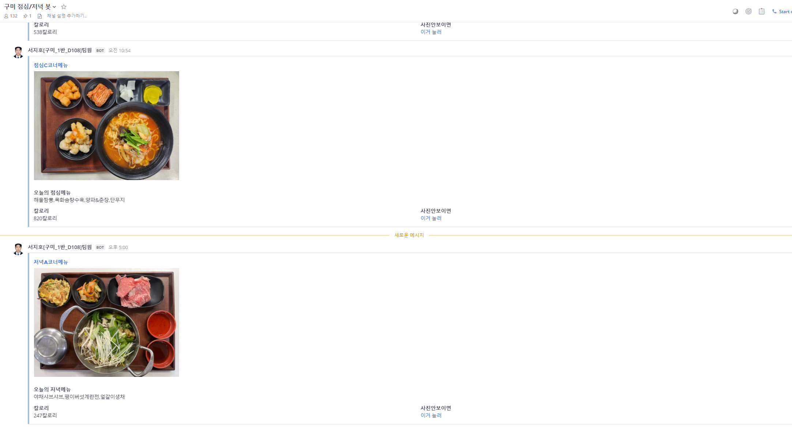

# ssafy_lunch_bot

<h1 align="center">
   
  ssafy_lunch_bot - Automatically upload menu to MM.
   
</h1>

## Contributors

<table>
  <tbody>
    <tr>
      <td align="center"><a href="https://github.com/NEU-chaldea"> <b>NEU-chaldea</b></a> <a href="#maintenance-flaxinger" title="Maintenance">🚧</a></td>
      <td align="center"><a href="https://github.com/FantBlog"> <b>FantBlog</b></a> <a href="https://github.com/BaekjoonHub/BaekjoonHub/commits?author=cokemania2" title="Code">💻</a></td>    </tr>
  </tbody>
</table>

<!--- 소개 --->

## 싸피런치봇이란?(What is ssafy_lunch_bot?)

  ssafy_lunch_bot은 Welstory+의 오픈 api를 이용하여 점심 및 저녁메뉴의 목록과, 사진을 MetterMost에 업로드를 해주는 프로그램 입니다. 

 
 

<!--- 작동 원리 --->

## 작동원리(How it works)

### 1. 동작 화면

MM 동작 화면

 

### 2. 작동원리

Welstory+에 점심 메뉴 사진은 AM 11시에 저녁 메뉴 사진은 PM 05시에 업로드 된다는 점을 이용하여 특정 시간이 되면 사진이 올라올 때까지 재탐색 하여 사진이 올라오는 시점에 MM에 메뉴사진을 첨부하여 메뉴리스트를 업로드 해주게 됩니다.

 

# 버전관리
#### v1.1 변경사항

 식당이 바빠서 식단은 올렷는데 사진을 올리지 못하는 경우가 가끔 있습니다. 
기존의 식단봇은 서버에 메뉴 정보가 있어도 사진이 없으면 계속해서 데이터를 받아오기 때문에 
결과적으로 12시에도 식단이 MetterMost에 올라오지 않게됩니다.  
v1.1 에서는 위의 상황에 빠질시 11:10분에 임의의 사진으로 대체하여
MetterMost에 올라가도록 수정하였습니다.  
 

#### v1.2 변경사항

 디자인 변경, 사진 없을시 링크 추가, 저녁에 사진 늦을시 대체 처리  

#### v1.3 변경사항

 식사시간 변경으로 인한 수정  

 

 켰을때, 11시 전에 사진이 올라올때, 17시에 업로드  

#### v1.4 변경사항

 갱신시간 5초에서 300초로 변경  

 요청이 많아서인지 웰스토리에서 데이터를 못받아옴  

 

 또한 하드코딩되서 데이터가 변경되면 오류뜨던걸 고유 값 탐색으로 커버되게 수정  

